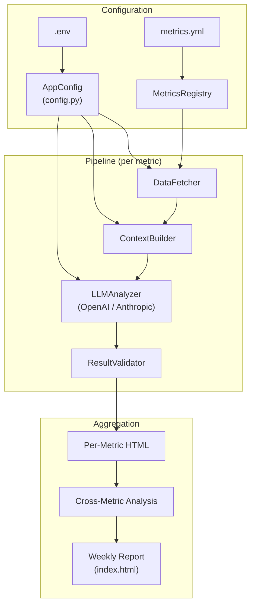

# Report Agent


Concise, modular system to generate **weekly data reports** directly from ClickHouse + dbt docs using LLM code execution (OpenAI Code Interpreter or Anthropic Claude Code Execution).

The model receives **raw tables** (CSV) plus neutral context (schema, meta, optional dbt docs), then decides how to analyze, visualize, and summarize — **no precomputed metrics**. Each run produces:

* Per-metric HTML reports with BD-friendly narrative and plots.
* A unified weekly report HTML that synthesizes findings across all metrics.
* Cross-metric analysis discovering relationships and ecosystem patterns.

---

## Key Features

* **Multi-provider**: Switch between OpenAI and Anthropic via `LLM_PROVIDER` env var. Provider-agnostic abstraction via `LLMAnalyzer` interface.
* **Free-form analysis**: Model runs Python in a sandbox (OpenAI Code Interpreter or Claude Code Execution), no fixed toolchain.
* **Pipeline architecture**: Four isolated stages with dependency injection — testable and extensible.
* **Parallel processing**: Concurrent metric processing with `--max-workers` (default 3). Anthropic clients retry on rate limits (`max_retries=2`); OpenAI calls fail fast (`max_retries=0`).
* **Structured output + validation**: LLM returns structured JSON with key numbers and statistical evidence, validated against actual data to prevent over-interpretation.
* **Cross-metric analysis**: Discovers correlations, ecosystem patterns, and contradictions across metrics.
* **Significance detection**: Strict criteria (>15% change, >2 std devs) prevent false positives — only truly noteworthy changes are reported.
* **Cost tracking**: Token usage and estimated costs aggregated per run across all API calls.
* **Neutral context**: Attaches `*.schema.json`, `*.meta.json`, optional `*.docs.md`, and model catalog for discovery.
* **Static HTML**: Dark-themed reports with shared external CSS, all assets via relative paths.

---

## Architecture



The pipeline is orchestrated by `ReportPipeline`. All dependencies are injected at the CLI level (`cli/main.py` acts as composition root) — no hidden global state. Each parallel worker gets its own `ClickHouseConnector` for thread safety.

| Stage | Responsibility |
|-------|---------------|
| **DataFetcher** | Queries ClickHouse for time series or snapshot data |
| **ContextBuilder** | Writes CSV, schema, meta, docs to temp dir; builds prompt with slim catalog |
| **LLMAnalyzer** | Uploads files, runs code execution, parses structured output + narrative |
| **ResultValidator** | Validates significance claims against actual data |

The `LLMAnalyzer` base class has two implementations: `OpenAIAnalyzer` (Responses API + Code Interpreter) and `ClaudeAnalyzer` (Messages API + Code Execution with prompt caching). The active provider is selected via `LLM_PROVIDER`.

### Significance Detection

```
HIGH   — >15% change AND >2 std devs AND unusual pattern AND clear business impact
MEDIUM — >10% change OR >1.5 std devs AND somewhat unusual
LOW    — Within normal variation or expected patterns
```

---

## Repository Layout

```
report_agent/
  cli/
    main.py                       # CLI entrypoint (installed as `report-agent`)

  config.py                       # centralized typed configuration (AppConfig)

  connectors/
    db/
      clickhouse_connector.py     # read-only ClickHouse client
    llm/
      __init__.py                 # factory functions (create_analyzer, create_chat_client, etc.)

  metrics/
    metrics.yml                   # metric list + kind + history_days
    metrics_loader.py             # fetch_time_series() and fetch_snapshot()
    metrics_registry.py           # loads metrics.yml, helpers (list_models, get_kind, etc.)

  dbt_context/
    from_docs_json.py             # optional dbt manifest/docs ingestion

  nlg/
    prompt_builder.py             # builds CI prompts (time_series vs snapshot)
    html_report.py                # render per-metric HTML
    report_service.py             # run pipeline -> download plots -> save CSV/text -> HTML
    summary_service.py            # unified weekly report synthesizing all metrics
    cross_metric_service.py       # cross-metric correlation analysis
    templates/
      ci_report_prompt.j2         # time-series CI prompt
      ci_snapshot_prompt.j2       # snapshot CI prompt
      report_page.html.j2         # per-metric HTML template
      summary_page.html.j2        # weekly report HTML template
      static/
        report.css                # shared stylesheet for all HTML reports

  pipeline/
    orchestrator.py               # ReportPipeline (coordinates all stages)
    models.py                     # data models (MetricData, AnalysisContext, etc.)
    exceptions.py                 # custom exceptions (PipelineError, etc.)
    stages/
      data_fetcher.py             # stage 1: fetch data from ClickHouse
      context_builder.py          # stage 2: prepare files and prompts for LLM
      llm_analyzer.py             # stage 3: abstract LLM analyzer interface
      openai_analyzer.py          # stage 3: OpenAI Code Interpreter implementation
      claude_analyzer.py          # stage 3: Anthropic Claude Code Execution implementation
      validator.py                # stage 4: validate LLM output against data

  utils/
    cost_tracker.py               # API usage tracking and cost estimation
```

---

## Quick Start

```bash
# 1. Install
pip install -e .

# 2. Configure
cp .env.example .env   # fill in credentials

# 3. Define metrics
#    Edit report_agent/metrics/metrics.yml

# 4. Run
report-agent                                          # all metrics, parallel
report-agent --metric api_p2p_discv4_clients_daily    # single metric
report-agent --max-workers 5                          # custom parallelism
report-agent --out-dir gnosis_reports --no-summary    # custom output, skip summary
report-agent --verbose                                # debug logging
```

---

## Configuration

Set credentials in `.env` (loaded by `config.py`):

```bash
# LLM provider: "openai" (default) or "anthropic"
LLM_PROVIDER=openai

# OpenAI
OPENAI_API_KEY=...
# OPENAI_MODEL=gpt-4.1

# Anthropic (required if LLM_PROVIDER=anthropic)
# ANTHROPIC_API_KEY=...
# ANTHROPIC_MODEL=claude-sonnet-4-20250514

# ClickHouse
CLICKHOUSE_HOST=...
CLICKHOUSE_USER=...
CLICKHOUSE_PASSWORD=...
CLICKHOUSE_DB_READ=dbt
CLICKHOUSE_DB_WRITE=playground_max
CLICKHOUSE_SECURE=true

# dbt docs / manifest (optional)
DBT_MANIFEST_PATH=/path/to/manifest.json
# DBT_DOCS_BASE_URL=https://your-dbt-docs-root/
```

Define metrics in `report_agent/metrics/metrics.yml`:

```yaml
metrics:
  - model: api_p2p_discv4_clients_daily
    kind: time_series        # date column required; value = measure, label = dimension
    history_days: 180

  - model: api_execution_transactions_active_accounts_7d
    kind: snapshot           # no date filter; value, optional change_pct, optional label
```

---

## Troubleshooting

* **ClickHouse UNKNOWN_IDENTIFIER date**: Mark snapshot tables as `kind: snapshot` in `metrics.yml` so they don't get a `WHERE date` filter.
* **Plots not generated**: Not guaranteed due to Code Interpreter limitations. Reports are complete without them. Warning is printed if missing.
* **Plots not visible in HTML**: Check that PNGs exist in `reports/plots/` and open the HTML from the same directory tree (paths are relative).
* **No weekly report**: Ensure you didn't pass `--no-summary` and that at least one metric completed successfully.
* **Parallel processing issues**: Try `--max-workers 1` for sequential execution.
* **API connection errors**: External API issues, not code bugs. Anthropic clients auto-retry on rate limits (429); OpenAI failures are reported immediately.

---

## Roadmap

* Unit / integration / prompt regression tests.
* More metric kinds and templates (e.g. funnels, distributions).
* Prompt versioning and A/B testing.
* Slack / email delivery on schedule.
* Additional LLM providers (e.g. Gemini) via the `LLMAnalyzer` interface.
* LLM-based result validation to complement the rule-based validator.
